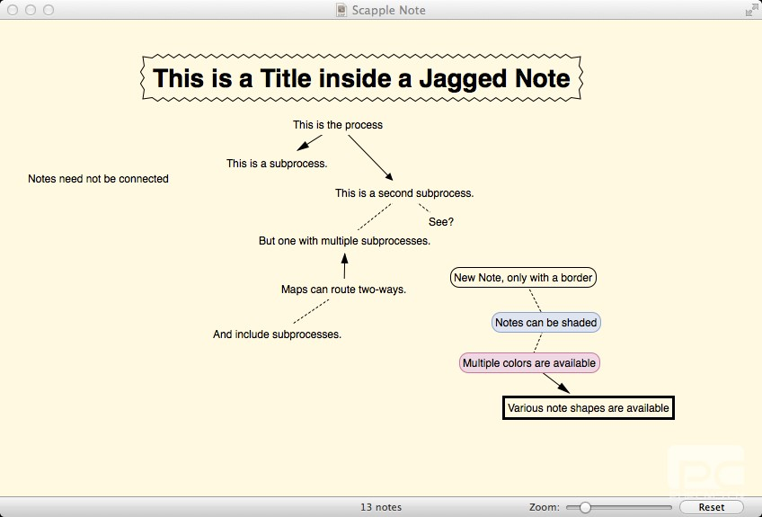
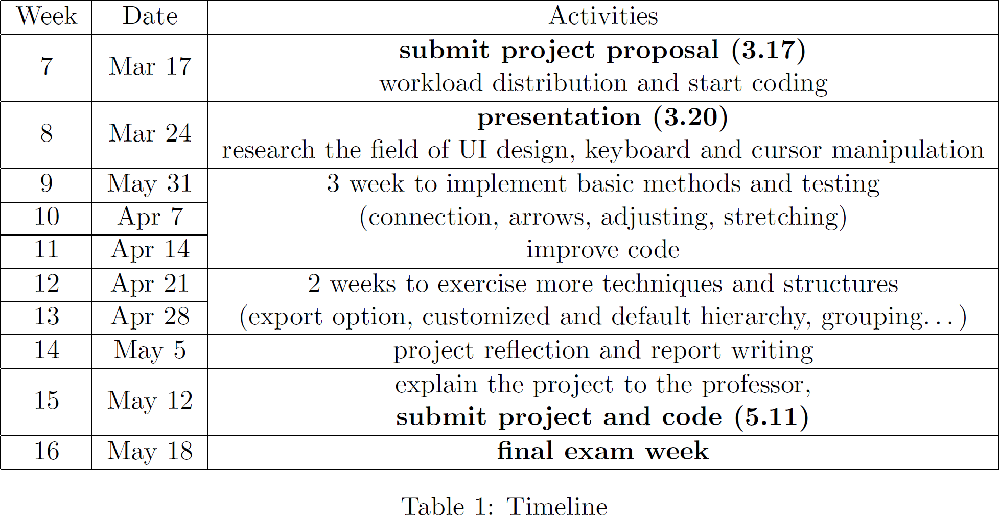

A LITE TOOLKIT FOR BRAINSTORMING

# BrainLine

## 1 Introduction

The concept of mind-map is first introduced in the 1970s by educational trainer Tony Buzan. It aims to illustrate ideas through scattering and connection. Mind-maps for brainstorming serve to indicate not only raw ideas, but also visually represent their relationships and their significance, and how they were derived.

This project is dedicated to provide a lite software solution for such brainstorming process. Unlike many other Mind Mapping tools already in the market, our project does not require user to start a central idea as the highest hierarchy, neither does we force to connect. Individuals could create a new node anywhere on the canvas by easily double click and then scatter the idea on the interface. Connections, grouping and hierarchy can be defined and modified after letting out all thoughts. In other words, we facilitate brainstorming by freeing users to separate idea-taking and idea-connecting process. Our purpose remains to make its Note taking process as quick and fluid as it is on paper. We further empower users to arrange hierarchy among their input so that the software could optimize the visualization of these ideas. Apart from user-defined hierarchy, we provide a panoply of  methods and physical appearance choices of Note for better visualization. 

## 2 Challenge and Solution

The main challenge of our project lies in distributing workflow and user interface design. 

The close relationship between major class “Note” and its functions make it hard to assign coding components among the group. We overcome the problem in two ways: 1) Work closely with each other, and actively employ version control tools such as git to keep coding progress on the same page; 2) Implement a vanilla Note struct first to facilitate further function testing, that is to say, complex Note class design and its advanced methods could go in the same time without tangling with each other in the aid of a vanilla Note class; 3) Separate the essential method implementation into several parts to distribute workflow, including Note struct design, user interface design, physical appearance design and connection design.

Specifically, challenging tasks in user interface design would at least include: 1) keeping multimedia object inline with text; 2) auto stretching connection line and 3) auto fitting multimedia object. Our current solution intends to adopt existing related C++ libraries to deal with photo object. Besides, we might create a distinct photo and connectLine class or struct to adjust direction and length attribute.

Other challenges may include 1) exporting the file to PNG, 2) grouping the notes and 3) providing customized hierarchy. Assisted with object oriented programming, we propose to take advantage of parent-children class to handle hierarchy and priority level. Stack data structure will be implemented to exercise default priority. Later in our implementation phase, we would devise other efficient structures to facilitate such user-defined hierarchy. In addition, we would conduct full research in the next week in user interface design and relationship between cursor and keyboard manipulation. Our research would endow us with more insights in these problem and we would specify our solutions in our project and final report.

## 3 Implementation

This part will introduce the main functions of the mind-map application. These functions are fundamental functions, which will be realized with the top priority. Other functions will be introduced in the Possible Modification part, which will be handled latter depending on the progress and time remaining.

### 3.1 Basic functions and prototypes

#### 3.1.1 Create a node:

A double click on any blank space of the map by the mouse will trigger an interrupt service routine to create a new node and ask the user to input text content inside the node.

#### 3.1.2 Delete a node:

Right click the mouse on the node, a dialog box with menu will appear, and the user is able to delete the node. A number of other functions can also be integrated in the menu, such as modifying the background color of the node and the font of the characters.

#### 3.1.3 Adjust a node:

The position of a node can be freely adjusted on the map by simply dragging the node to anywhere the user wants.

#### 3.1.4 Create a connection:

The node can be drag to another to make connection between the two. A connection is allowed to be made between any two nodes.

#### 3.1.5 Modify the content inside a node:

Double click on a node and a cursor will appear inside the node and allow the user to modify the text.

#### 3.1.6 Display:

The mind map will be able to be zoomed in and zoomed out. To achieve that, a display area is defined on the map, which is proportional with the user window.

### 3.2 Essential data structure

A struct “Node” is created to store all the data, including the position of the node, which is declared by the double click of the mouse, the length and width of the node, the content inside the node, as well as other nodes it is connected with.

Here is a demonstration of what we would like to achieve:

## 4 Possible Modification

Compared to the user interface coming from a mind-map app that already has a high level of completion and refinement as shown in the implementation part, the UI in our project may supposedly be in a lower visual quality, but the most basic idea of allowing user to sort their mind by typing down and connecting notes will be realized, regarded as the main goal the team will focus on to achieve at the first place. Besides these major functions mentioned above, some modifications are also worth trying out to make this little tool more user-friendly and practical. Here are some extra interesting functions that might be further expanded in the project hopefully.

### 4.1 More note styles and connection styles

Not only the colors of notes’ border and the bubble can be changed according to user’s preference, but the connections between two notes can also be chosen among dash line, arrow and double-sided arrow to make the UI more dynamic and enrich user experience.

### 4.2 Inheritance function (Adopt and Reproduce)

#### 4.2.1 Adopt

Users can set some notes as child notes and find a note as parent note for those child notes. The note styles of child note, such as text font, text color, and bubble styles, will be changed into the exact same style with that parent note, no matter what styles they had before the inheritance relation happened.

#### 4.2.2 Reproduce

Moreover, users can also start from a parent note and let it give birth to many children, the note styles of which will inherit from the note style of the parent.

Once the parent-children relation is activated, a connection will be created between the two notes. The default style will be a one-sided arrow pointing from parent to child. Marked that every child note can only have one parent note. The multi-parent situation is not allowed.

### 4.3 Shortcut actions including connect all and disconnect}

If the user gets tired to do the drag work to connect all the nodes that he/she wants to link together, a shortcut action will be much helpful and time-saving. Connect all constructs links between every two nodes that are selected. Disconnect just simply withdraws all the connections the selected nodes have on them.

### 4.4 Undo function

This function allows users to go back to the last stage when the action has not been made.

### 4.5 Align function

If users want his/her notes to be shown in a more organized way, this function can be helpful. It makes selected notes align along with the main note by their top, bottom, left or right edges. Or just align their centers by sharing the same horizontal position or vertical position with the main note. Marked that the note with the highest vertical position among selected notes will be the main note.

### 4.6 Textbox function

The notes are written in a textbox. This function will adjust the shape of the textbox in order to adapt the amount of input text.

### 4.7 To-do list

This function can let users add a checkbox in front of a note if the note happens to inform users that something should be done. Users can make a yes mark in the checkbox to remind themselves that the task has been finished.

After the main part is done, what the team is expecting is to further work on the expansion of these functions and explore more programming diagrams to improve the project. Though it largely depends on the rate of our progress and whether the problems occurred can be fixed smoothly, time and efforts will be devoted by all means, for which a deliberate timeline and detailed work division will be the best guarantee.

## 5 Timeline & Work allocation

